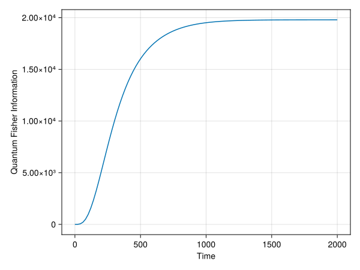

This notebook demonstrates the computation of Quantum Fisher Information (QFI) for a driven-dissipative Kerr Parametric Oscillator (KPO) using automatic differentiation. The QFI quantifies the ultimate precision limit for parameter estimation in quantum systems.

We import the necessary packages for quantum simulations and automatic differentiation:

````julia
using QuantumToolbox      # Quantum optics simulations
using DifferentiationInterface  # Unified automatic differentiation interface
using SciMLSensitivity   # Allows for ODE sensitivity analysis
using FiniteDiff         # Finite difference methods
using LinearAlgebra      # Linear algebra operations
using CairoMakie              # Plotting
CairoMakie.activate!(type = "svg")
````

## System Parameters and Hamiltonian

The KPO system is governed by the Hamiltonian:
$$H = -p_1 a^\dagger a + K (a^\dagger)^2 a^2 - G (a^\dagger a^\dagger + a a)$$

where:

- $p_1$ is the parameter we want to estimate (detuning)
- $K$ is the Kerr nonlinearity
- $G$ is the parametric drive strength
- $\gamma$ is the decay rate

````julia
function final_state(p, t)
    G, K, γ = 0.002, 0.001, 0.01

    N = 20 # cutoff of the Hilbert space dimension
    a = destroy(N) # annihilation operator

    coef(p,t) = - p[1]
    H = QobjEvo(a' * a , coef) + K * a' * a' * a * a - G * (a' * a' + a * a)
    c_ops = [sqrt(γ)*a]
    ψ0 = fock(N, 0) # initial state

    tlist = range(0, 2000, 100)
    sol = mesolve(H, ψ0, tlist, c_ops; params = p, progress_bar = Val(false), saveat = [t])
    return sol.states[end].data
end
````

````
final_state (generic function with 1 method)
````

## Quantum Fisher Information Calculation

The QFI is computed using the symmetric logarithmic derivative (SLD). For a density matrix $\rho(\theta)$ parametrized by $\theta$:

$$F_Q = \text{Tr}[\partial_\theta \rho \cdot L]$$

where $L$ is the SLD satisfying: $\partial_\theta \rho = \frac{1}{2}(\rho L + L \rho)$

````julia
function compute_fisher_information(ρ, dρ)
    reg = 1e-12 * I # Add small regularization to avoid numerical issues with zero eigenvalues
    ρ_reg = ρ + reg

    L = sylvester(ρ_reg, ρ_reg, -2*dρ) # This is a Sylvester equation: ρL + Lρ = 2*dρ
    F = real(tr(dρ * L)) # Fisher information F = Tr(dρ * L)
    return F
end
````

````
compute_fisher_information (generic function with 1 method)
````

## Automatic Differentiation Setup

We use finite differences through DifferentiationInterface.jl to compute the derivative of the quantum state with respect to the parameter. This is a key step that enables efficient QFI computation without manual derivative calculations.

````julia
final_state([0], 100) # Test the system

state(p) = final_state(p, 2000) # Define state function for automatic differentiation

ρ, dρ = DifferentiationInterface.value_and_jacobian(state, AutoFiniteDiff(), [0.0])

dρ = QuantumToolbox.vec2mat(vec(dρ)) # Reshape the derivative back to matrix form

qfi_final = compute_fisher_information(ρ, dρ) # Compute QFI at final time
println("QFI at final time: ", qfi_final)
````

````
QFI at final time: 19795.821946511165

````

## Time Evolution of Quantum Fisher Information

Now we compute how the QFI evolves over time to understand the optimal measurement time for parameter estimation:

````julia
ts = range(0, 2000, 100)

QFI_t = map(ts) do t
    state(p) = final_state(p, t)
    ρ, dρ = DifferentiationInterface.value_and_jacobian(state, AutoFiniteDiff(), [0.0])
    dρ = QuantumToolbox.vec2mat(vec(dρ))
    compute_fisher_information(ρ, dρ)
end

println("QFI computed for ", length(ts), " time points")
````

````
QFI computed for 100 time points

````

## Visualization

Plot the time evolution of the Quantum Fisher Information:

````julia
fig = Figure()
ax = Axis(
 fig[1,1],
 xlabel = "Time",
 ylabel = "Quantum Fisher Information"
)
lines!(ax, ts, QFI_t)
fig
````


## Version Information

````julia
using InteractiveUtils
InteractiveUtils.versioninfo()
````

````
Julia Version 1.10.10
Commit 95f30e51f41 (2025-06-27 09:51 UTC)
Build Info:
  Official https://julialang.org/ release
Platform Info:
  OS: Linux (x86_64-linux-gnu)
  CPU: 12 × AMD Ryzen 5 5600X 6-Core Processor
  WORD_SIZE: 64
  LIBM: libopenlibm
  LLVM: libLLVM-15.0.7 (ORCJIT, znver3)
Threads: 10 default, 0 interactive, 5 GC (on 12 virtual cores)
Environment:
  JULIA_EDITOR = code
  JULIA_VSCODE_REPL = 1
  JULIA_NUM_THREADS = 10

````

````julia
using Pkg
Pkg.status()
````

````
Status `/var/home/oameye/Documents/website/content/posts/Quantum_Fisher_Information/Project.toml`
⌃ [13f3f980] CairoMakie v0.13.10
  [a0c0ee7d] DifferentiationInterface v0.7.2
  [6a86dc24] FiniteDiff v2.27.0
  [98b081ad] Literate v2.20.1
  [6c2fb7c5] QuantumToolbox v0.32.1
  [1ed8b502] SciMLSensitivity v7.87.0
  [37e2e46d] LinearAlgebra
Info Packages marked with ⌃ have new versions available and may be upgradable.

````

---

*This page was generated using [Literate.jl](https://github.com/fredrikekre/Literate.jl).*

